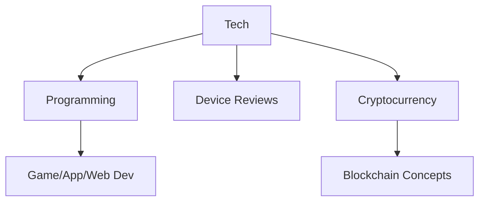
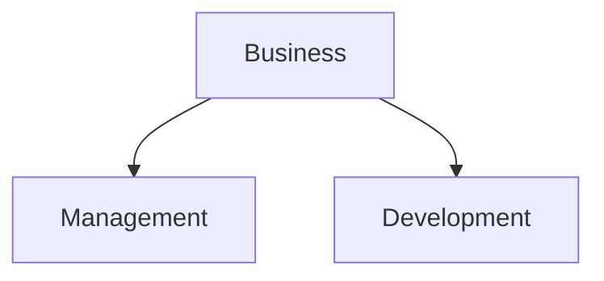
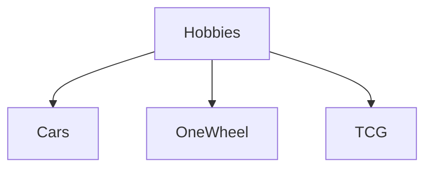

# Welcome to My Blog!

Hello there, and thank you for visiting my corner of the internet! This blog is a reflection of my journey, interests, and projects, and I’m excited to share it all with you.

---

## About Me

I’m a tech enthusiast with a passion for innovation, creativity, and problem-solving. From crafting apps to exploring new devices, I’ve always been intrigued by how technology shapes our lives and the opportunities it creates. Beyond tech, I’m deeply interested in the world of cryptocurrency and investments, constantly learning about trends, strategies, and the future of finance.

### Quick Facts

- **Favorite Programming Language:** Python 🐍
- **Favorite Gadget:** My trusty Raspberry Pi 🥧
- **Crypto of Choice:** Polygon {: w="15" h="15" .shadow .rounded-10 }

---

### **Highlight: Why Tech Fascinates Me**

> "Technology isn’t just a tool; it’s a canvas for creativity and a gateway to endless possibilities."
{: .prompt-info }
---

## What to Expect

This blog will be a space for me to share my thoughts, experiences, and projects. Here’s a glimpse of what you can look forward to:

- **Cryptocurrency Insights:**
 
  I’ll delve into the fascinating world of crypto, sharing news, analysis, and my personal journey navigating this dynamic space.
  {: .prompt-tip } 
- **Investment Ideas:**
  Explore discussions about smart investments, portfolio building, and strategies for financial growth.
  {: .prompt-tip }  

- **Programming Adventures:**
  Whether it’s a new app I’m building, a game concept I’m developing, or tips and tricks I’ve learned, I’ll share my coding journey here.
  {: .prompt-tip }  

- **Tech Reviews:**
  From the latest gadgets to software tools, I’ll provide honest reviews and insights to help you decide what’s worth your time and money.
  {: .prompt-tip }  

- **General Sentiments & Opinions:**
  This will be my space to talk about everything from the state of the tech industry to broader cultural and societal impacts of innovation.
  {: .prompt-info }  

- **Hobbies & Projects:**
  As someone who loves to create, I’ll document my side projects, hobbies, and lessons learned along the way.
  {: .prompt-info }  

---

### **Visual Showcase**

{: w="800" h="400" .shadow .rounded-10 }
> *A glimpse into my workspace, where ideas come to life.*

---

## Why This Blog?

I’ve always believed in the power of sharing knowledge and experiences. This blog is my way of contributing to the communities I’m passionate about, while also creating a platform for discussion and collaboration. Whether you’re here to learn, exchange ideas, or simply stay curious, I hope you’ll find something valuable.

---

### Mathematics Example

To give you a sense of the kind of topics we’ll cover, here’s a math equation I’ve always found fascinating:

$$
\int_{a}^{b} x^2 dx = \frac{b^3}{3} - \frac{a^3}{3}
$$

> "This equation shows how to calculate the area under the curve of the function  between two points  and . It’s a foundational concept in calculus and highlights how we use math to solve real-world problems."
{: .prompt-info }

---

### **Quote to Leave You Inspired**
> "Innovation comes to those who are curious and unafraid to explore the unknown."
{: .prompt-tip }

---

### **Interactive Diagram**

---

Thank you for joining me on this journey. I’m looking forward to connecting with you and growing this blog into a space where ideas flourish and inspiration thrives.

Stay tuned for my next post—let’s explore, create, and innovate together!

